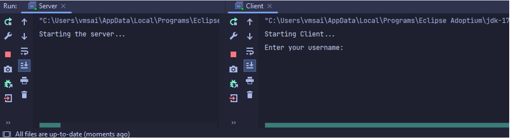
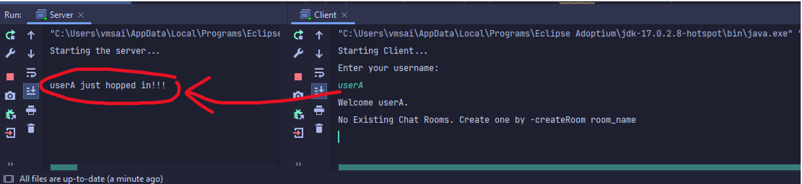
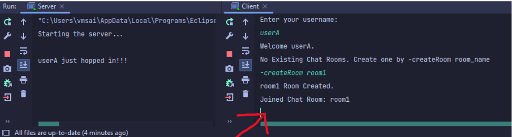
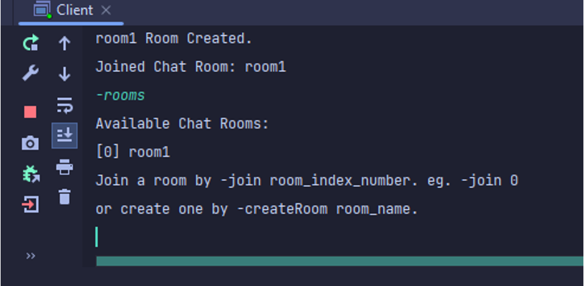
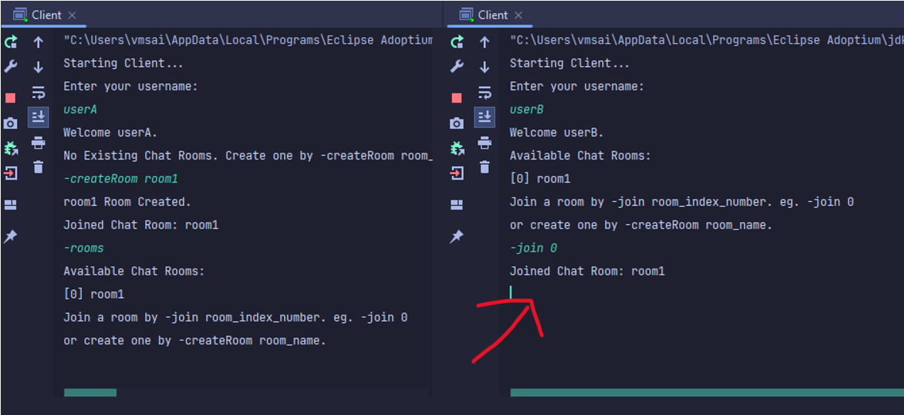
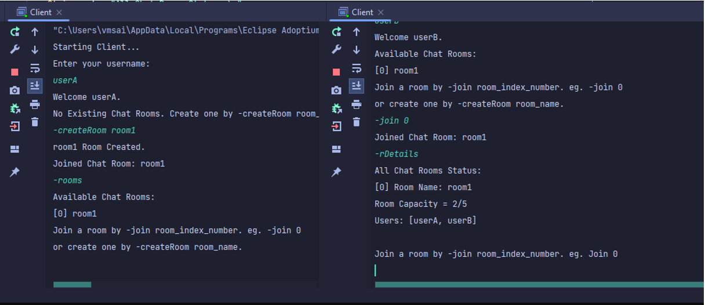
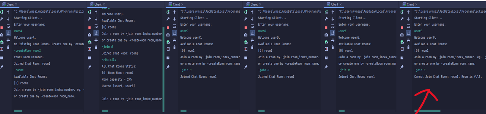
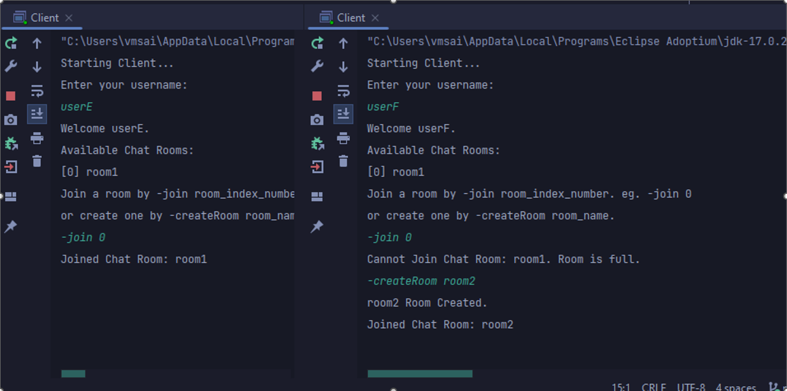
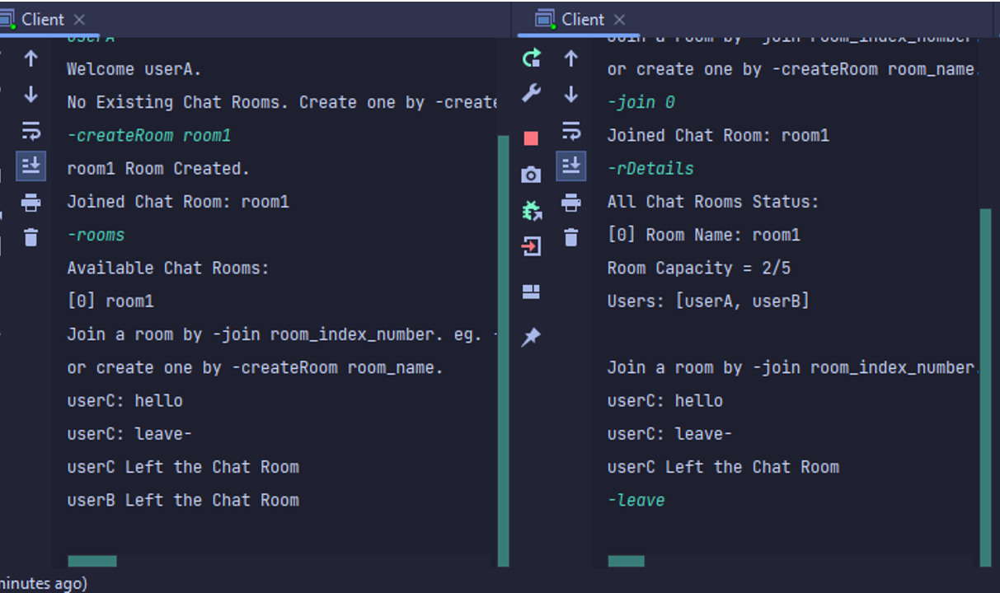
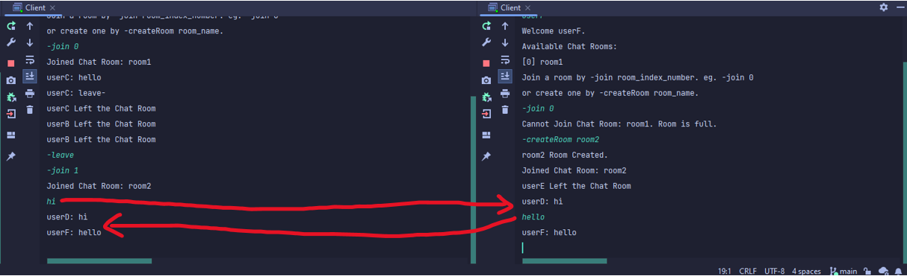

# TCP Chat Application
This chat application allows clients to connect to a server and participate in chat rooms.

## Features
1. View a list of existing chat rooms
2. View the number and list of connected users for each room
3. Join existing chat rooms if there is capacity
4. Create chat rooms
5. Send messages to chat rooms
6. Leave a chat room

## How to Run

### Compile

From your terminal in the root directory of this project,

    javac -d bin src\*.java

First, Start the server by running the Server class.
    
    java -cp bin\ Server

Second, Start the client by running the Client class.

    java -cp bin\ Client

Follow the prompts in the client interface to connect to the server and participate in chat rooms.

## List of Commands
A dash `-` is command mode.
- `-createRoom 'room_Name'` without the quotes.
- `-rooms` to list all the rooms.
- `-join 1` to join room number 1. It starts from 0. 
- `-rDetails` current room details.
- `-leave` to leave to current room.

## What I have learned
1. How to use sockets and TCP connections to create a client-server application in Java.
2. How to send and receive data over a network connection.
3. How to design and implement a simple chat application with multiple chat rooms.
4. The importance of thread safety when working with concurrent connections.

## Here is a Demonstration of the application step by step.

#### Initial state:

After entering the username, the client gets connected to the server via TCP:

 

#### View list of existing chat rooms:

First a room has to be created in order to see the room list. Via `-createRoom room_Name`

Now list rooms by `-rooms`

 

#### Join existing chat rooms:

Write `-join "room number"` without the quotes to join. Room number starts from 0, 1, ...

 

#### View the number and list of connected users for each room

From any client, write `-rDetails`

 

#### Check room capacity and restrict access to full capacity rooms

Now initiating 6 clients in total, 5 will be joining in one room, the 6th client won’t be able to join on that room.

 

#### Create chat rooms
Write `-createRoom room_name` to create a room.

 

#### Leave a chat room
Write `-leave` to leave the room from any client. Other connected clients in the room will be informed.

 

#### Send messages to chat rooms

 
